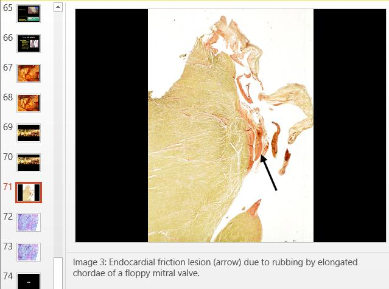
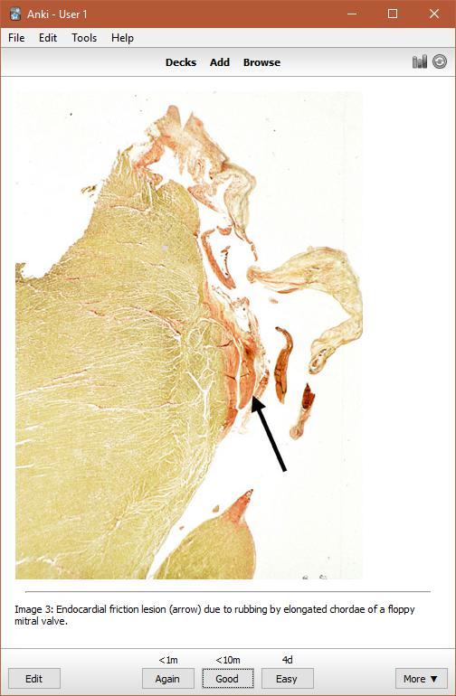
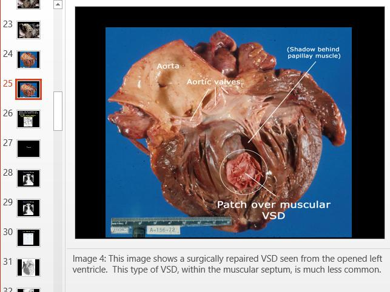
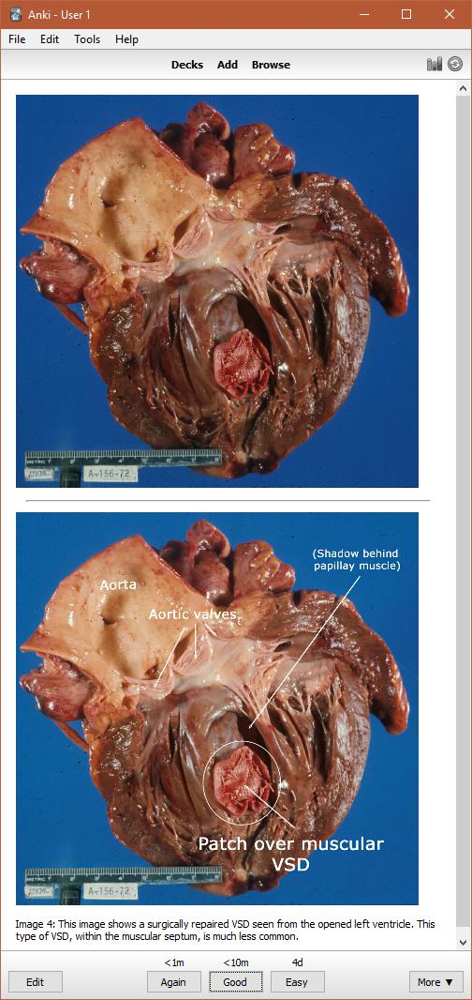

# pptx2anki

Convert a PPTX file (with notes and/or annotated images) to an [Anki](https://apps.ankiweb.net/)-compatible flashcard deck.

## Installation

You'll probably want a virtualenv to install the dependencies in (be sure you're using Python 3.x):

```
mkvirtualenv -p /usr/bin/python3 pptx2anki
```

Then, install those dependencies:

```
pip install -r requirements.txt
```

Finally, run the script:

```
./pptx2anki.py my_presentation.pptx
```

## PowerPoint Formatting

As of [January 2018](https://github.com/bdunnette/pptx2anki/tree/b969dcdfa73a23b07ee67601622324863cbeb08d), this tool relies on PPTX files being formatted as follows:

* The slide for the "front" of the card should contain 1 image (NOTE: if you modify or crop the image in PowerPoint, these modifications WILL NOT appear on the card, so it's recommended to edit images outside of PowerPoint and then add them to slides!)
* The "front" slide should also contain presenter notes - these are used to group slides/cards, and will be added to the card's "back"
* If you want a "back" image for the card, place that slide immediately after the "front" slide, and _with the same notes as the front_ - otherwise, the notes from the "front" slide will simply be placed on the card's "back"

### Examples

|Card Type|PowerPoint (front)|PowerPoint (back)|Anki|
|---|---|---|---|
|Front Image Only||N/A||
|Front and Back Images||(Note that notes section has the same text as the "front" slide)||
